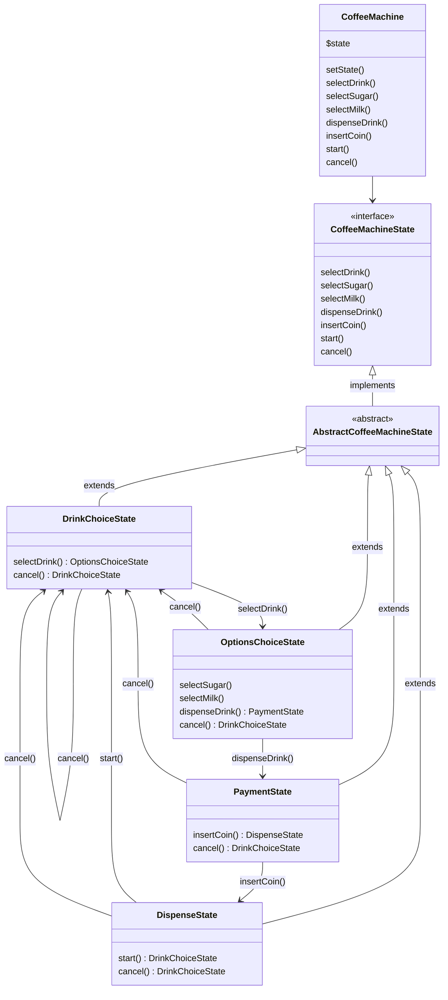

# Causeway: Machine à Café

## Description

Cette application simule une machine à café qui permet à l'utilisateur de sélectionner et de personnaliser différentes boissons (café, thé, chocolat) en ajoutant du sucre et du lait.

L'application utilise des design patterns tels que **State** et **Decorator** pour gérer les différentes étapes de l'interaction avec la machine.

En effet nous pouvons considérer cette machine à café comme un automate de type [FSM](https://en.wikipedia.org/wiki/Finite-state_machine).

> La logique de la machine est pensée pour convenir à un usage moderne d'une machine à café (pouvoir annuler et récupérer son crédit à tout moment, rendre les étapes de sélection de sucre/lait optionnelles...).
> Cela explique en partie la relative complexité du code.
> Un système moins flexible et pas-à-pas (bloquant) aurait certes été plus simple/rapide à mettre en place mais j'ai privilégié l'évolutivité, tout en essayant de proposer un code simple à maintenir selon les principes DRY et SOLID.

## Diagram



## Installation

Clone the project
`composer install`

TODO

Check // TODO comments

DrinkEnum::TEA->name; // 'TEA'
DrinkEnum::TEA->value; // 2
DrinkEnum::TEA->label(); // 'Thé'
DrinkEnum::from(2)->label(); // 'Thé'

Add `final` to classes ?

add `declare(strict_types=1);` ?

créer des dossiers pour les __State.php, etc ___Decorator.php

add logs instead of echos?

## Usage

Run tests unit tests

```shell
./vendor/bin/phpunit tests
```
