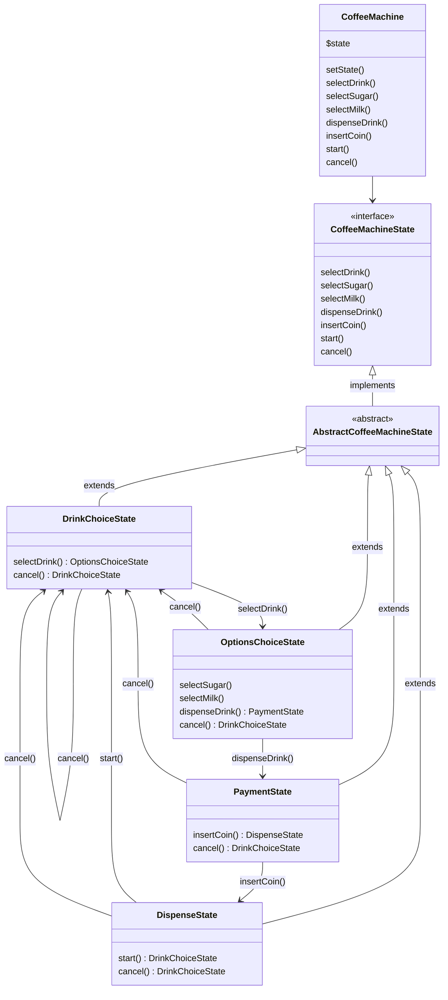

# Causeway: Machine à Café

## Description

Cette application simule une machine à café qui permet à l'utilisateur de sélectionner et de personnaliser différentes boissons (café, thé, chocolat) en ajoutant du sucre et du lait.

L'application utilise des design patterns tels que **State** et **Decorator** pour gérer les différentes étapes de l'interaction avec la machine.

En effet nous pouvons considérer cette machine à café comme un automate de type [FSM](https://en.wikipedia.org/wiki/Finite-state_machine).

## Diagram



## Installation

Clone the project
composer install

ça aussi ?
composer dump-autoload -o

## Usage

Run tests unit tests

```shell
./vendor/bin/phpunit tests
```
