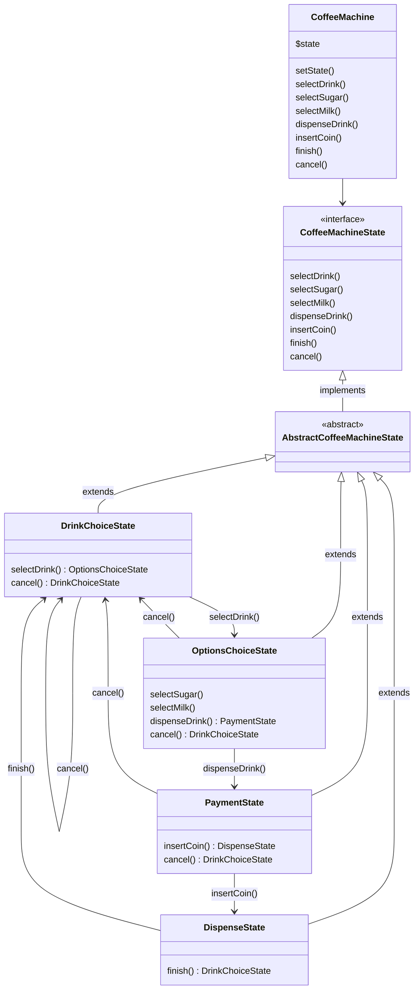

# Causeway: Machine à Café

## Description

Cette application simule une machine à café qui permet à l'utilisateur de sélectionner et de personnaliser différentes boissons (café, thé, chocolat) en ajoutant du sucre et du lait.

L'application utilise des design patterns tels que **State** et **Decorator** pour gérer les différentes étapes de l'interaction avec la machine.

En effet nous pouvons considérer cette machine à café comme un automate de type [FSM](https://en.wikipedia.org/wiki/Finite-state_machine).

> La logique de la machine est pensée pour convenir à un usage moderne d'une machine à café (pouvoir annuler et récupérer son crédit à tout moment, rendre les étapes de sélection de sucre/lait optionnelles...).
> Cela explique en partie la relative complexité du code.
> Un système moins flexible et pas-à-pas (bloquant) aurait certes été plus simple/rapide à mettre en place mais j'ai privilégié l'évolutivité, tout en essayant de proposer un code simple à maintenir selon certains principes (DRY, SOLID, Composition, Polymorphism).

## State diagram

Here is an UDM representing the State flow of the machine:



## Structure

The source code follows the following structure:

```shell
├── src
│   ├── Drink/
│   ├── Enum/
│   ├── State/
│   ├── Trait/
│   ├── Utility/
│   ├── CoffeeMachine.php
```

**Drink/ folder:** This folder holds all classes related to drinks, including the base `Drink` class and specific drinks (`Coffee`, `Tea`, `Chocolate`) as well as the decorators.

**Enum/ folder:** Contains the `DrinkEnum`, which is specifically related to the kinds of drinks.

**State/ folder:** This folder contains all classes related to the state management of the coffee machine. The states themselves and the exceptions related to state transitions are grouped here.

**Trait/ folder:** Any traits, like `CancellableTrait`, can be organized here. This makes it clear that these are reusable components.

**Utility/ folder:** Contains a Logger file. But could contain other utility-first classes.

**CoffeeMachine.php:** The entry point of the coffee machine's backend.

## Installation

Clone the project
`composer install`

* tester cancel cli
* café sans sucre alors que si
* PHP cs fixer

## Usage

Run this command to interact with a coffee machine made in ASCII-art right into your terminal!

It's a step-by-step manipulation, not one-shot.

```shell
php cli.php
```

Run this command to get an instant feedback of the machine.

It's a one-shot manipulation, not step-by-step.

> You can change the parameters in the script file directly.

```shell
php cli-no-interaction.php
```

## Unit testing

You can run the tests by running PHPUnit:

> Just did one test to showcase the feature.

```shell
vendor/bin/phpunit tests
```

## Code analysis

You can run a static analysis of the code base by running PHPStan:

```shell
vendor/bin/phpstan analyse src tests
```
