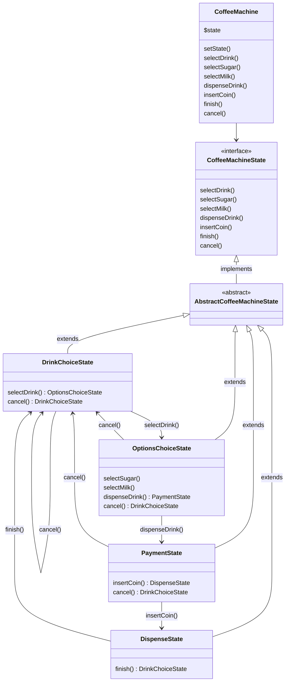

# Causeway: Machine à Café

## Description

Cette application simule une machine à café qui permet à l'utilisateur de sélectionner et de personnaliser différentes boissons (café, thé, chocolat) en ajoutant du sucre et du lait.

L'application utilise des design patterns tels que **State** et **Decorator** pour gérer les différentes étapes de l'interaction avec la machine.

En effet nous pouvons considérer cette machine à café comme un automate de type [FSM](https://en.wikipedia.org/wiki/Finite-state_machine).

> La logique de la machine est pensée pour convenir à un usage moderne d'une machine à café (pouvoir annuler et récupérer son crédit à tout moment, rendre les étapes de sélection de sucre/lait optionnelles...).
> Cela explique en partie la relative complexité du code.
> Un système moins flexible et pas-à-pas (bloquant) aurait certes été plus simple/rapide à mettre en place mais j'ai privilégié l'évolutivité, tout en essayant de proposer un code simple à maintenir selon les principes DRY et SOLID.

## State diagram

Here is an UDM representing the State flow of the machine:



## Structure

The source code follows the following structure:

```shell
├── src
│   ├── Drink
│   │   ├── Chocolate.php
│   │   ├── Coffee.php
│   │   ├── DrinkDecorator.php
│   │   ├── Drink.php
│   │   ├── MilkDecorator.php
│   │   ├── SugarDecorator.php
│   │   └── Tea.php
│   ├── Enum
│   │   └── DrinkEnum.php
│   ├── State
│   │   ├── AbstractCoffeeMachineState.php
│   │   ├── CoffeeMachineState.php
│   │   ├── DispenseState.php
│   │   ├── DrinkChoiceState.php
│   │   ├── IllegalStateTransitionException.php
│   │   ├── OptionsChoiceState.php
│   │   └── PaymentState.php
│   ├─── Trait
│   │   ├── CancellableTrait.php
│   │   └── CoinHandlerTrait.php
│   ├── CoffeeMachine.php
```

**Drink:** This folder holds all classes related to drinks, including the base `Drink` class and specific drinks (`Coffee`, `Tea`, `Chocolate`) as well as the decorators.

**Enum:** Contains the `DrinkEnum`, which is specifically related to the kinds of drinks.

**State:** This folder contains all classes related to the state management of the coffee machine. The states themselves and the exceptions related to state transitions are grouped here.

**Trait:** Any traits, like `CancellableTrait`, can be organized here. This makes it clear that these are reusable components.

## Installation

Clone the project
`composer install`

rename $drink to $drinkObject when applicable

DrinkEnum::TEA->name; // 'TEA'
DrinkEnum::TEA->value; // 2
DrinkEnum::TEA->label(); // 'Thé'
DrinkEnum::from(2)->label(); // 'Thé'

add logs instead of echos?

## Usage

Run tests unit tests

```shell
./vendor/bin/phpunit tests
```
