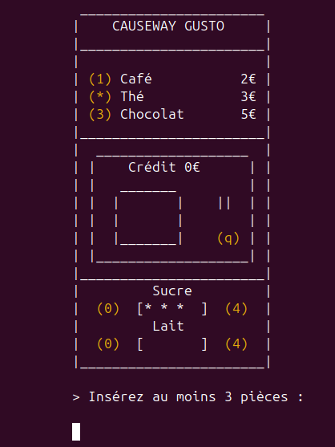
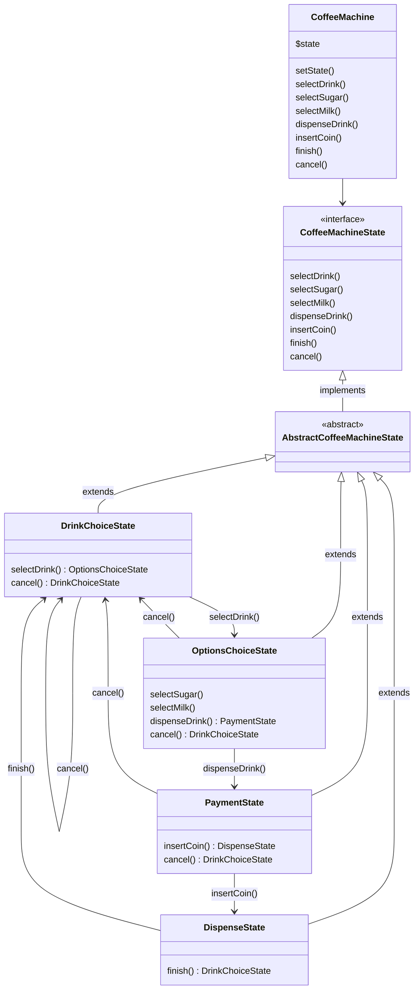

# Causeway: Machine à Café

## Description

This project implements a coffee machine simulation using Object-Oriented Programming principles and design patterns. It allows users to select drinks, customize them with sugar and milk, and handle payments.

### Features

- **Drink Selection**: Users can choose from different types of drinks (e.g., Coffee, Tea, Chocolate).
- **Customization Options**: Users can select sugar and milk levels for their drinks.
- **Payment Handling**: The system manages user credit and processes payments.
- **State Management**: The coffee machine utilizes the State design pattern to manage transitions between different states (e.g., DrinkChoiceState, OptionsChoiceState, PaymentState). Indeed, this machine is a type of [FSM](https://en.wikipedia.org/wiki/Finite-state_machine).
- **Logging**: Detailed logs for debugging and user feedback.

### Architecture

The project is structured around the following key components:

- **Drink Classes**: Each drink (`Coffee`, `Tea`, `Chocolate`) extends an abstract `Drink` class, implementing common properties and methods.
- **Decorator Pattern**: The `DrinkDecorator` class and its subclasses (`SugarDecorator`, `MilkDecorator`) allow for dynamic customization of drinks.
- **State Management**: The entry point `CoffeeMachine` class manages the current state and facilitates transitions between states.

## Installation

1. Clone the repository
2. Navigate to the directory: `cd coffee-machine`
3. Install dependencies: `composer install`

## Usage

### With user interactions

Run this command to interact with the coffee machine made in ASCII-art right into your terminal!

It's a *step-by-step* manipulation, not *one-shot*.

```shell
php cli.php
```



### Without user interaction

Run this command to get an instant feedback of the machine.

It's a one-shot manipulation, not step-by-step.

> You may change the given parameters in the script file directly.

```shell
php cli-no-interaction.php
```

## Unit testing

The project includes unit tests for each state, ensuring that all main functionalities work as expected.

Run the tests with:

```shell
vendor/bin/phpunit tests --colors
```

## Code analysis

You can run a static analysis of the code base by running PHPStan:

```shell
vendor/bin/phpstan analyse src tests
```

## Code linting

You can lint the source code by running PHP-CS-Fixer:

```shell
vendor/bin/php-cs-fixer fix src
```

## State diagram

Here is an UDM representing the State flow of the machine:


